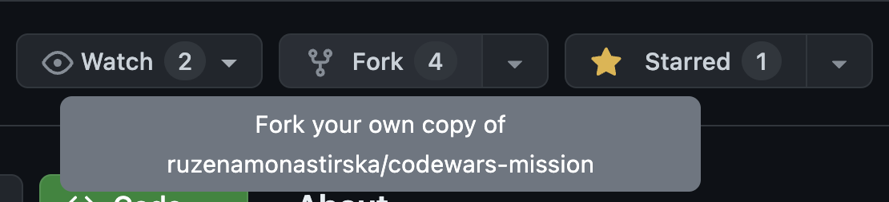

# Simple way to commit your code
Put your code in the folder corresponding to the challenge and have your name in the file title!

# Fork the repo (more complex, but a cooler way to commit your code)
1. On this repositories GitHub page click "Fork" in the top right corner:

2. In your forked repository put your code in the folder corresponding to the challenge and have your name in the file title!
3. Commit your changes in your forked repository
4. `git push upstream main`
    - To merge the changes made in your forked repository back into the original repository
    - NOTE: There might be a conflict, but mostly there shouldn't

## Updating original repository with your changes
1. `git fetch upstream`
2. `git checkout main`
3. `git merge upstream/main`
4. Fix merge conflicts
5. Commit all your changes to your forked repository
6. `git push upstream main`
   - To merge the changes made in your forked repository back into the original repository
